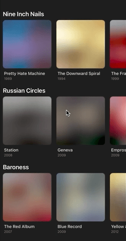

# Beautiful image placeholders for React Native

This is a sample project which showcases two strategies for displaying dynamic image placeholders:

- linear gradients
- blurhashes



You can read about the different techniques in [the article on my website](https://tsvetan.dev/blog/article/beautiful-gradient-placeholders-for-images-in-react-native/).

## Prerequisites

You must have set up iOS/Android development environment with React Native.

## Install

```bash
npm i && npx pod-install
```

## Run

```bash
# iOS
npm run ios

# Android
npm run android
```
